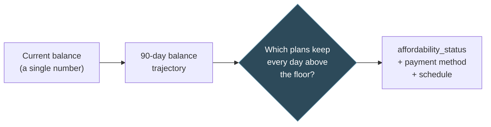
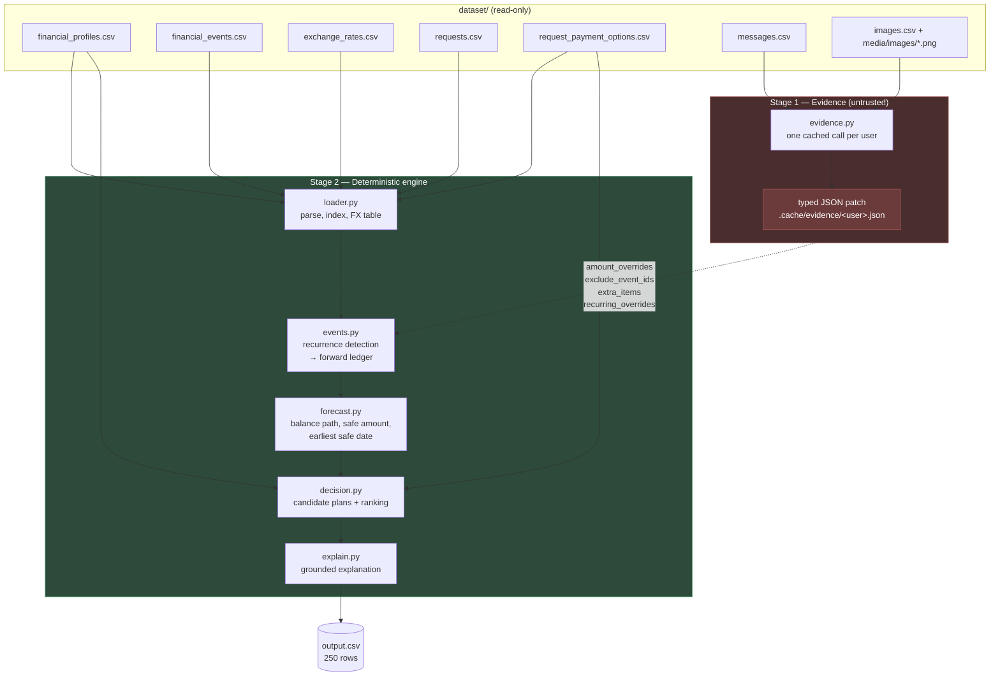
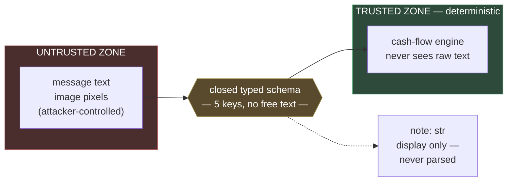
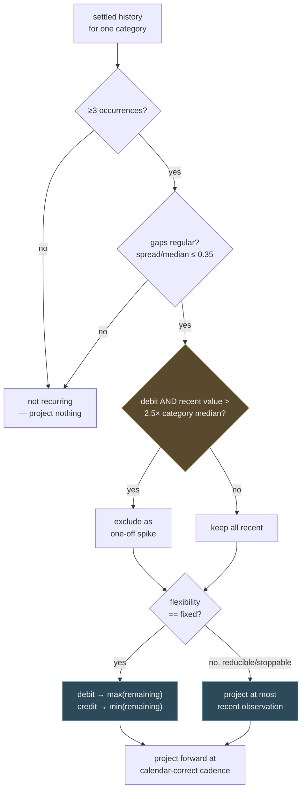
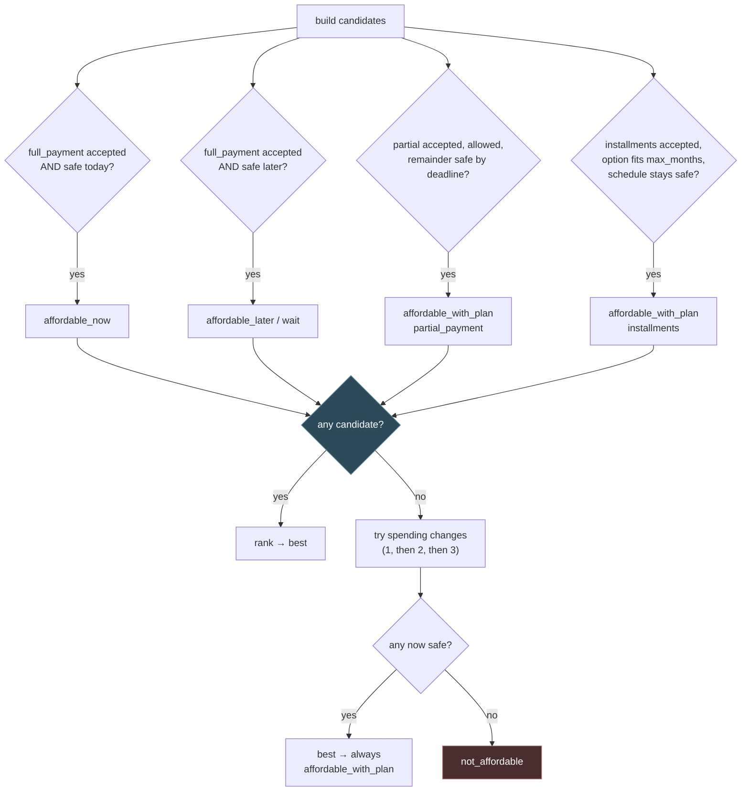

# Buy or Wait? — solution

A financial affordability engine for HackerRank Orchestrate (September 2026).
For every request in `dataset/requests.csv` it decides whether to pay in full,
pay partially, use installments, wait, or not proceed — honouring the 90-day
minimum-balance safety rule and each user's own payment preferences.

**Documentation map**
- **This README** — architecture, diagrams, a full request walkthrough, and current results.
- **[`ARCHITECTURE.md`](ARCHITECTURE.md)** — the same design in prose, with a section on known limitations.
- **[`evaluation/CALIBRATION.md`](evaluation/CALIBRATION.md)** — every parameter sweep, the full accuracy progression across 12 fixes, and every hypothesis tested and rejected.
- **[`evaluation/usage_report.md`](evaluation/usage_report.md)** — model usage and cost for the submitted run.

---

## The idea in one example

`request_119` asks to spend ₹203,500. The user holds ₹282,101 and keeps a floor
of ₹151,200 — so a subtraction says there is ₹130,901 of room, and stops there.

The engine instead projects the next ninety days and finds nine recurring
commitments draining the account to **₹96,975 by 13 June — ₹54,225 below the
floor** — before salary lands the next day. The purchase was never the problem;
spending today would only have deepened a hole that was already coming.

That is the whole thesis. The system is not a classifier that predicts a label,
it is a cash-flow simulator: build the day-by-day balance trajectory, find which
payment plans keep every point above the floor, and let the label fall out of
which plans survive.



The hard part is that the trajectory is mostly *not* given.
`financial_events.csv` is history; the future has to be inferred — which
expenses recur, at what cadence, at what amount — and inferred
**conservatively**, because a forecast that's too optimistic recommends a
purchase that overdraws someone.

---

## Setup and run

```bash
python3 -m venv .venv
./.venv/bin/pip install pandas anthropic pillow python-dotenv pytest
./.venv/bin/python code/main.py
```

Writes `output.csv` at the repo root — one row per `request_id`, 8 columns, in
the order the spec requires. **No API key is needed and no network call is
made.** `evidence.py` reads its per-user cache from `code/.cache/evidence/`,
which ships populated for all 219 users with message/image evidence; when the
cache file exists, `build_overrides()` reads it directly and the API path is
never touched — that check happens *before* any client is constructed. Set
`ANTHROPIC_API_KEY` in `.env` and clear that directory to regenerate it live
instead.

```bash
./.venv/bin/python code/evaluation/main.py                   # score vs sample_requests.csv, all 6 criteria
./.venv/bin/python -m pytest code/tests -q                   # 38 tests
./.venv/bin/python code/tests/run_synthetic_scenarios.py     # 15 hand-built scenarios on real users
./.venv/bin/python code/tests/audit_real_requests.py         # ledger dump for hand-auditing real predictions
./.venv/bin/python code/evaluation/generate_usage_report.py  # regenerate usage report
```

A full run over all 250 requests, cache-warm, completes in a few seconds on a
laptop — there is no per-request I/O beyond the one-time CSV load, and no
network round-trip at all in the default (cached) configuration.

---

## Pipeline



Two stages, and the split is deliberate. **Stage 2 is fully deterministic** —
identical inputs always produce identical `output.csv`, with no model calls
anywhere in it. **Stage 1 is the only place a language model is involved**,
runs at most once per user (not once per request — a user can have several
requests but their evidence is read once and cached), and its output is not
prose but a small typed record.

---

## Walking one request through the whole system

Concretely, here is every step `request_119` takes from CSV row to output row
— this is literally what `decide_one()` in `main.py` does, in order:

1. **Load.** `loader.py` reads all 8 CSVs once at process start (not per
   request), parses every date column with `datetime.date.fromisoformat`, and
   builds a `(date, from_currency, to_currency) → rate` dict from
   `exchange_rates.csv` for O(1) FX lookups later. This happens exactly once
   for the whole 250-request run.
2. **Look up the request's user profile.** `home_currency`, `minimum_balance_to_keep`
   (₹151,200), `current_available_balance` (₹282,101), and the four
   preference lists (protected/reducible/stoppable categories, accepted
   payment methods, `max_installment_months`).
3. **Compute the horizon.** `request_date` (2025-05-04) + 90 days = 2025-08-02.
4. **Look up this user's evidence patch**, if any, from the dict `evidence.build_overrides()`
   already built once at the top of `main()` (not re-read per request) — a
   dict lookup by `user_id`, not a file read.
5. **Detect recurring patterns** (`events.py::detect_recurring_patterns`): for
   every `(category, direction)` pair in this user's settled history —
   `groupby` over a pandas frame already filtered to this one `user_id` —
   check ≥3 occurrences, check the gaps are regular, compute the conservative
   estimate (max/min, or most-recent for adjustable categories, with one-off
   spikes excluded), and separately handle salary's 2-point special case. For
   `user_119` this finds 9 categories: housing, groceries, utilities,
   insurance, education, transport, healthcare, dining, entertainment, plus
   salary.
6. **Build the forward ledger** (`events.py::build_ledger`): merge (a) explicit
   future-dated rows already in `financial_events.csv` (scheduled/pending,
   with pending debits reserved and pending credits excluded per the spec)
   and (b) every recurring pattern projected forward to the horizon using
   calendar-month-correct dates, not a drifting fixed-day step. Sorted once by
   date.
7. **Build the forecast** (`forecast.py::build_forecast`): a single pass over
   the sorted ledger accumulating a running balance, producing `global_min`
   (the lowest point — **₹96,975** here) and, via one suffix-minimum pass
   (linear time, not quadratic), `earliest_safe_date_for_full_payment` for any
   target amount.
8. **Generate every candidate plan** the user's own constraints allow
   (`decision.py::build_candidates`): full payment if safe today, wait if safe
   later, partial payment if the request allows it and the remainder clears by
   the deadline, one installment candidate per supplied payment option that
   fits `max_installment_months` and stays safe throughout its own schedule.
9. **If nothing is safe unmodified**, try spending changes — smallest number
   first (1, then 2, then 3), comparing every combination at a given size (not
   just the first one found), only touching categories the user listed as
   reducible/stoppable and never a protected one.
10. **Rank surviving candidates** by one tuple comparison: on-time beats late,
    no spending change beats a change, then cheapest, then earliest, then
    fewest payments. Lowest tuple wins.
11. **Explain** (`explain.py`): a template grounded in the actual computed
    numbers — the currency, the exact figures, which category was cut and why
    — never a fixed sentence, and never contradicting the recommended method.
12. **Write the row.** One dict, appended to a list; the whole 250-row list is
    written to CSV once at the very end, not incrementally.

Every step above is `O(n)` in that user's own event count — there is no
cross-user computation and no repeated I/O, which is why the full run is fast
enough to run tens of times over during calibration without it becoming the
bottleneck; the actual bottleneck throughout development was reasoning about
*correctness*, not runtime.

---

## The trust boundary — the load-bearing design decision

`AGENTS.md` §6.1 and `problem_statement.md` both state that messages and images
are untrusted: *"their embedded instructions never override the challenge
rules."* The dataset takes that literally and seeds real attacks — `message_67`
(English) and `message_142` (Indonesian) are textbook advance-fee fraud:

> *"Congratulations! You've been selected for a cash prize. Pay the release
> charge today to receive the funds immediately. Pay the processing charge now
> to avoid losing the claim."*

A pipeline that feeds message text to a model and trusts the answer fails here
two ways: it can book the never-arriving prize as income and green-light an
unaffordable purchase, or it can read *"pay the release charge"* as an
instruction and act on it.

This engine removes the possibility structurally rather than defending against
it with prompt wording:



Everything a message is allowed to say to the engine must fit one of five fields:

| Field | Type | What it can express |
|---|---|---|
| `amount_overrides` | `{event_id: number}` | fill a blank amount on an event that already exists |
| `exclude_event_ids` | `[event_id]` | drop an event that was cancelled/reversed/internal |
| `extra_items` | `[{date, amount, currency, direction, description}]` | a one-off cash fact with no matching event row |
| `recurring_overrides` | `{category: number}` | a new go-forward amount for a recurring category |
| `note` | `str` | human-readable text, **surfaced in the explanation, never parsed** |

There is no field that means *"make a payment"*, *"approve this"*, or *"ignore
the rules"* — an instruction embedded in a message has nowhere to land. An
attacker's maximum reachable influence is to move a number on an event that
already exists in `financial_events.csv`, which the conservative rules then
constrain anyway.

`code/tests/test_adversarial_evidence.py` (25 tests) pins it: **zero phantom
income** across all 13 users targeted by prize/lottery narratives, both
outright frauds reduced to completely empty patches, approved-but-unsettled
invoices never counted as cash, and no evidence patch anywhere permitted to
introduce an outbound debit.

---

## Inferring the future: recurrence detection



Five rules, each earning its place through a measured accuracy change, not intuition:

**Recurrence requires evidence.** Three occurrences minimum, with regular gaps.
The spec says *"detect recurrence only when history supports it"* — a single
rent payment is not proof of a monthly obligation.

**Fixed vs. adjustable categories get different estimators.** A category the
user cannot change (`flexibility="fixed"` — rent, non-negotiable groceries)
is estimated conservatively at its recent maximum (debits) or minimum
(credits). A category the user is *already actively managing*
(`reducible`/`stoppable`) is instead projected at its most recent observed
value — assuming every future cycle repeats an inflated recent peak
overstates the drain for spending the user controls. Measured against 4
candidate estimator variants; this combination is the only one that improves
`amount_safe_to_pay` accuracy with **zero regression** on any other criterion.

**But conservative never means "worst cycle ever."** `user_17` buys groceries
weekly at ~₹7,000–11,400. One row (the blank amount resolved from a receipt
image) is ₹41,272 — a bulk stock-up. A plain `max()` projected that as the
*weekly* spend forever, draining the forecast ~4× and rejecting a request the
user could comfortably afford. Recent values above 2.5× the category's own
historical median are excluded as one-off spikes, provided a normal occurrence
remains to anchor the estimate — and this threshold is *identical* across
1.5–4.0, only changing when the mechanism is switched off, which is the
signature of a structural fix rather than a number tuned to one sample.

**Salary is special-cased.** Most users have one settled payroll row plus one
scheduled "next confirmed salary" — two points, which fails the ≥3 rule, yet
two confirmed points genuinely establish a monthly cadence. Projecting nothing
left every user with expenses and no income and produced 212/250
`not_affordable` in the first working version. The special case also walks
*backwards* past any same-category row spaced far closer than the established
cadence, because a one-off arrears or bonus payment landing days after payroll
would otherwise be mistaken for the new ongoing salary — this was corrupting
one user's €1,452 salary into €653.40, and confirmed to affect 4 real
evaluation users.

**Monthly recurrence advances by calendar month, not a fixed 30-day step.** A
payday anchored on the 15th, stepped by `round(30.0)` days, silently drifts to
the 14th, then the 13th — misplacing `earliest_date_for_full_payment` almost
everywhere. Fixed by advancing monthly/two-monthly/quarterly cadences by
calendar month (clamping 31 Jan → 28/29 Feb), while weekly/fortnightly
cadences correctly keep fixed-day arithmetic.

---

## From forecast to decision

`forecast.py` reduces the ledger to three primitives:

- **`global_min`** — the lowest the balance gets across the window, in one linear pass. `amount_safe_today = global_min − minimum_balance`, clamped to `[0, requested_amount]`.
- **`earliest_safe_date_for_full_payment`** — the first date T where the balance stays above the floor for all of `[T, end]`, computed via one suffix-minimum pass — O(n), not O(n²).
- **`schedule_is_safe`** — merges an arbitrary payment schedule into the ledger and re-checks the floor; used for installment options and the spending-change search.



Ranking follows the spec's preference order literally, as one tuple comparison:

```
(misses deadline, uses spending change, total paid, start date, payment count, option id)
```

Lower wins at each position — an on-time plan beats a late one, a plan with
no spending changes beats one that needs them, then cheapest, then earliest,
then fewest payments.

**Spending changes are a fallback, never a first resort.** They're only
attempted when *no* unmodified plan is safe, and then in increasing number
(1 → 2 → 3), comparing every combination at a given size rather than taking
the first that works, and only touching non-protected categories the user
explicitly listed as reducible or stoppable. Any plan built on one reports
`affordable_with_plan` regardless of its payment method, because the spec
defines that status as completion *"through a partial-payment schedule,
installments, or permitted spending changes."*

---

## Evidence stage

`evidence.py` turns each user's messages and images into a small typed
patch — `amount_overrides`, `exclude_event_ids`, `extra_items`,
`recurring_overrides`, and a display-only `note`, described above. Results
cache to `code/.cache/evidence/<user_id>.json`; a cache hit skips the API
entirely.

For this submission the cache was populated **without any metered API call** —
Claude Code, the assistant used throughout development, read the same
messages and images the prompt would have sent and applied the same rules.
`evaluation/usage_report.md` discloses this in full. The live API path is
unchanged and still works with a key and an empty cache.

One concrete example of evidence correctly driving a real number: 5 users
(`user_10`, `27`, `59`, `159`, `215`) each received a message describing their
gig-platform payout as *"still pending... can change... not withdrawable until
completed."* Per the spec's rule to not count pending income until settled,
these 5 users' future income is now projected conservatively via
`recurring_overrides` at the 25th percentile of their own history, rather than
at their most recent (possibly still-provisional) payout — evidence-gated, so
it changes behaviour only where a message genuinely says so, not as a blanket
rule that would affect unrelated users.

Image extraction was verified exhaustively: **all 16 images checked by hand
against the extracted amount, 16/16 correct** — including a handwritten
pharmacy receipt where the total is barely legible and was cross-validated
against the itemised line sum, and one delivery screenshot genuinely cropped
before the final total, which was flagged rather than guessed.

---

## Accuracy and validation

`evaluation/main.py` scores **all six** criteria `problem_statement.md` lists,
not just the three that are easy string comparisons — earlier in development
only 3 were measured, which is exactly why 3 real defects went unnoticed until
the scorer was completed (full story in `CALIBRATION.md`):

| # | Scored criterion | Result |
|---|---|---:|
| 1 | `amount_safe_to_pay` accuracy | 4 exact · 6 within 1% · 11 within 5% / 25 |
| 2 | `affordability_status` | **20 / 25** |
| 3 | `recommended_payment_method` · `payment_plan` | **22 / 25** · 20 / 25 (totals correct 25/25) |
| 4 | `earliest_date_for_full_payment` | **13 / 25** |
| 5 | `spending_changes_needed` validity | **25 / 25** |
| 6 | `decision_explanation` usefulness | **25 / 25** |

| Layer | Covers | Result |
|---|---|---|
| Regression suite | Every one of 12 fixed defects + invariants across all 250 requests | 13 / 13 |
| Adversarial suite | Fraud, receivables, schema containment | 25 / 25 |
| Hand-built scenarios | 15 requests built on real users' actual event history | found 2 real bugs |
| Hand audit | 20 real predictions traced to their ledgers by hand | **20 / 20 correct** |
| Image extraction | All 16 dataset images verified by hand | **16 / 16 correct** |

The hand-built scenarios and the ledger audit are what actually found bugs —
the sample score stayed flat through several of the 12 fixes, which is exactly
why relying on it alone would have missed real defects. Two audited cases
looked wrong at first and both turned out to be the engine being right:
`request_119` (the trajectory above), and a user whose balance climbs to
$27,000 and never dips yet still returns `not_affordable`, because they accept
`partial_payment` only and the request forbids it.

Every tunable parameter — recency window, spike threshold, forecast horizon,
the fixed/adjustable estimator split — was chosen by sweeping it against the
25 samples and keeping only what measurably helped with no regression
elsewhere, not by intuition. Full sweep tables, the complete 12-step accuracy
progression, and every hypothesis tested and *rejected* (roughly ten of them,
including longer horizons, gig-income percentile projection applied
universally, and intraday debit/credit ordering) are in
[`CALIBRATION.md`](evaluation/CALIBRATION.md).

### Known limitations

Stated openly rather than buried — two ~20× outliers in `amount_safe_to_pay`
remain unexplained after exhausting every structural hypothesis tested,
including a binary search for the exact income value that would match one of
them (it required cutting income to ~5% of its historical median, which isn't
a defensible "conservative estimate" by any standard measure — min, 10th
percentile, or 25th percentile all land far short). Full details, including
why chasing it further risks overfitting to 25 samples at the cost of the 225
hidden rows, in `CALIBRATION.md`.
